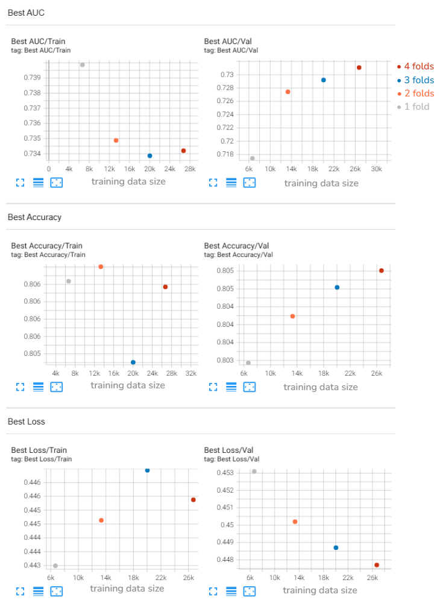

# Knowledge Tracing

## Objectives

Train a KT (Knowledge Tracing) model to predict (the probability of) whether the student will answer a question correctly, given their historical interactions. The model chosen for this project was the [SAKT](https://arxiv.org/abs/1907.06837) (**S**elf-**A**ttentive model for **K**nowledge **T**racing).

## Methodology

SAKT was chosen because:

1. it has a relatively simple architecture, see *Figure 1* below, hence is suitable as a benchmark model
1. uses self-attention, which has shown to be more performant compared to RNNs or LSTMs

*Figure 1: The SAKT model architecture*

**Inputs**

* question ID vector [0, .., 7651]
* response vector [0, 1]
* position vector [0, ..., 199]

Each of the learned embeddings has a dimension of 768, which is different to those used in the paper. It was chosen to match the pre-embedding dimension of the questions and content, i.e. to allow a direct sum of the two, see Figure 2 below.

A slightly modified version of the SAKT model was also trained. The question pre-embeddings were added to the learned question embeddings. This adds the questions' content information into the learned embedding before the attention section. There are several strategies to incorporate existing embeddings, however, addition was selected due to ease of implementation and the fact that it doesn't require additional parameters, which contributes to overfitting.

*Figure 2: The addition of the question pre-embeddings (shown in red).*

The third training session was the previous model but with an augmented training data. The training data was increased to have a row added between two adjacent rows for the same `uid` where the sequences were overlapped by 100. For example, if `uid` row 1 has a sequence of 1-200, and row 2 has a sequence of 201-400, a third row is inserted to have a sequence 101-300. This is to mitigate the bias introduced by the correlation of position and proportion of correct answers, see *Figure 3*.

## Results

The best validation result came from the SAKT model with question pre-embeddings, see *Table 1* for hyperparameters.

| Hyperparameter              | Value                | Notes                                              |
|-----------------------------|----------------------|----------------------------------------------------|
| Learning Rate               | 0.001                | Initial learning rate for the optimizer             |
| Optimizer                   | Adam                 | Optimization algorithm                             |
| Batch Size                  | 64                   | Number of sequences per training batch              |
| Max Sequence Length         | 200                  | Input sequence length provided in the given dataloader |
| Embedding Dimension         | 768                  | Dimension of question and item-interaction **learned** embeddings. This differs from the paper due to matching with the question pre-embeddings; this allows direct addition of the two embeddings. |
| Number of Attention Heads   | 6                    | In the multi-head self-attention layer. This differs from the paper (5) because it's the closest integer to the one prescribed in the paper and divides 768|
| Dropout Rate                | 0.2                  | Regularization strength                             |
| Loss Function               | Binary Cross-Entropy With Logits Loss | Objective function for binary prediction      |
| Early Stopping Metric       | Validation Accuracy  | Metric used to monitor for early stopping           |
| Early Stopping Patience     | 10                   | Epochs to wait for improvement before stopping      |
| Epochs Trained              | 35                   | Resulting number of epochs after early stopping     |

*Table 1: Hyperparameters for the model with the best validation accuracy*

The model with the highest validation accuracy (0.8054) is the SAKT with pre-embeddings and overlapping sequences narrowly beating the baseline (0.8052).

The accuracy on the test set was 0.7180.

### EDA

The dataset used is the [XES3G5M dataset](https://github.com/ai4ed/XES3G5M). They were downloaded from:
* [XES3G5M_interaction_sequences](https://huggingface.co/datasets/Atomi/XES3G5M_interaction_sequences)
* [XES3G5M_content_metadata](https://huggingface.co/datasets/Atomi/XES3G5M_content_metadata)

See [notebooks/eda.ipynb](notebooks/eda.ipynb) for details.

Below are some high-level information about the dataset:

* Number of rows in the training set: 33,397, each row containing sequences up to a length of 200.
* Number of rows in the test set: 3,613
* Number of unique questions: 7,653, one more than the reported 7652 in the paper (note: the extra index is `-1`, which is used for masking)
* Number of unique concepts: 866, one more than the reported 7652 in the paper (note: the extra index is `-1`, which is used for masking)
* Number of unique uid: 18,066
* Dimension of the question content and concept content embeddings: 768

The training data is split into 5 folds with another set as the test set. Each fold contains approximately

* training set: folds 1-4, 26712 rows
* validation set: fold 5, 6685 rows
* test set: 3613 rows

None of the users (`uid`) span across splits, which is ideal because this would allow the model to better generalise to new users.

All the students in the training data had sequences greater than 200.

**Data discrepancies**

* `concept_embeddings` contained 1175 rows whereas there are only 866 unique `concepts`; the latter is consistent with the original paper of 865 (note the extra ID is `-1`, which is reserved for padding). Due to this discrepancy, the `concept_embeddings` was not used. A possible explanation is that this is merely because not all of the concepts were interacted with by the students during the data collection period.
* Correlation of proportion of correct answers with sequence progression, i.e. on average, as students answer more questions, they are more likely to get the answer correct.

*Figure 3: Proportion of correct answers against the position in the sequence*

This means that the position encoding must be done carefully.

### Training

There were three training iterations conducted, all using the SAKT architecture:

1. SAKT original; mostly faithful to the model described in the original paper, validation accuracy (0.8052)
1. SAKT with question pre-embeddings; the above model with the addition of the question pre-embeddings, validation accuracy (0.8054)
1. SAKT with question pre-embeddings and overlapping sequences, validation accuracy (0.8053)

All models show very similar validation accuracy.

Training was conducted locally on a Windows machine running WSL Ubuntu with a GPU GTX1080 Ti. Training on 4 folds (and evaluation on one fold) took just under two minutes per epoch.

#### Learning Curve

Multiple training sessions were done on different dataset sizes to understand the learning curve.

*Figure 4: Learning Curve*

Increasing the training set size could improve the validation metrics.
 
### Evaluation

The model with the best validation accuracy achieved a test accuracy of 0.7893.

The large difference could be due to differences in the feature and target distribution differences.

|            | Accuracy | AUC    | Loss   |
| ---------- | -------- | ------ | ------ |
| training   | 0.8062   | 0.7336 | 0.4336 |
| validation | 0.8054   | 0.7323 | 0.4474 |
| test       | 0.7893   | 0.7180 |        |

*Table 2: Final results on the test set

## Concluding Remarks

Adding new features, such as the question pre-embeddings, and augmenting the training data, didn't seem to have had any meaningful impact on the validation accuracy. There are several potential explanations:

1. The new features are not informative
1. The model architecture is not using the extra information effectively

Given the higher reported values of other models that use this extra information (e.g. [SAINT](https://arxiv.org/pdf/2106.01342v1)), explanation 2 is the more likely.

### Strengths and Weaknesses

Strengths: SAKT's use of self-attention allows the model to potentially capture more complex and long-range dependencies in student learning sequences compared to traditional RNN approaches.

Weakness: 

* The original SAKT relies solely on interaction patterns. It doesn't include auxiliary information such as question and concept pre-embeddings, which are encoded content such as question wording. This exacerbates the cold start problem.
* Non-overlapping sequence partitions mean that subsequent partitions are treated as having started from scratch (i.e. without any history), however, as *Figure 3* shows, students are more likely to successfully answer later questions.

### Opportunities

1. Reduce embedding dimension
1. Try different sequence lengths
1. Include the knowledge concept pre-embeddings
1. Furter analyses of prediction results
    1. confusion matrix and varying the threshold for the tradeoff between false positive and false negative
    1. check if there are sets of questions on which the model performs particularly poorly
1. Add lag time (time between question `timestamp`s) and elapsed time (the time taken to complete a question). [SAINT+](https://arxiv.org/abs/2010.12042) has shown that including these time-based features improved the model.
1. Increase the data if possible.
1. Try different aggregation strategies for the pre-embeddings. Instead of addition, there is also concatenation. It's also worth investigating gated units, which can learn the optimal weight between the learned embeddings and the pre-embeddings.
1. Use sinusoidal encoding for the positions, rather than a learned embedding. This would reduce the number of parameters in the model.
1. Increase the position IDs beyond 200, to capture more history; though the latter part of very long sequences would run into sparsity problems.
1. Instead of Adam use AdamW optimiser, which has been shown to be superior to Adam for transformers.
1. Hyperparameter tuning
1. Try a different model such as SAINT+, which includes a wider variety of inputs

## Scripts

The `scripts` directory contains the shell scripts to run training and evaluation locally.
